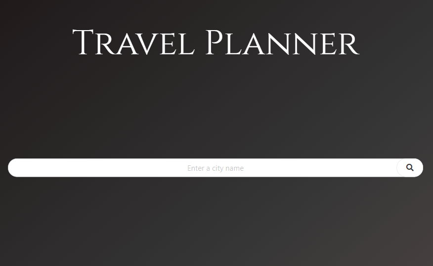

# Travel_App

This web application retrieves different information about a location.  It includes information about the weather forecast, upcoming events, and a map of the location.

 
 

## Internet Address

https://benjdg.github.io/Travel_App/

 
 

## Screenshot Desktop

 
 

## Screenshot Mobile

 
 

## Usage

To use the web application, only enter the name of the city and click the search button.

 
 

## Contributing

Pull requests are welcome. For major changes, please open an issue first to discuss what you would like to change.

 
 

## License
[GNU GPLv3](https://choosealicense.com/licenses/gpl-3.0/)